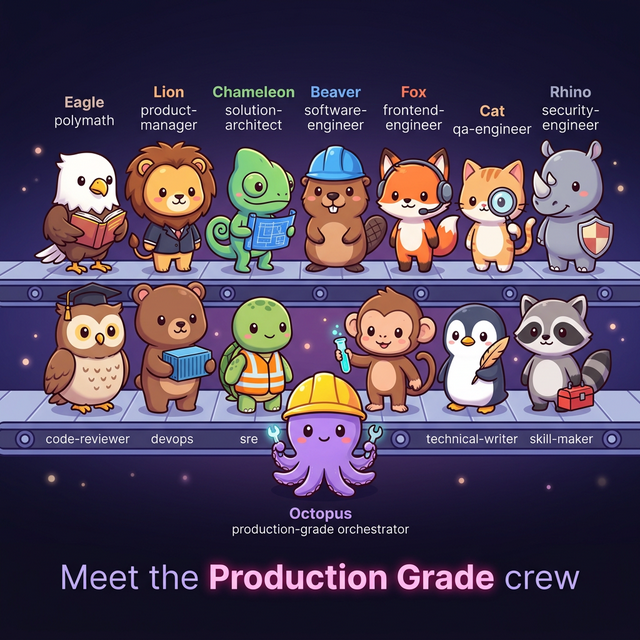

Plugin Production Grade para Claude Code
<p align="center">
  
</p>
<p align="center">
  <a href="https://github.com/nagisanzenin/claude-code-production-grade-plugin"></a>
  <a href="https://discord.gg/3ux2c5xz"></a>
  
  
  
  
  
</p>
<h3 align="center">14 agentes de IA, uma instalação, da ideia à produção.</h3>
````bash
/plugin marketplace add nagisanzenin/claude-code-plugins
/plugin install production-grade@nagisanzenin
```
<br>
Construído com Este Plugin
Criou algo com este plugin? Abra um PR para adicionar seu projeto aqui.
ProjetoAcesseDescriçãoPingBasepingbasez.vercel.appMonitoramento de uptime gratuito — receba um e-mail quando seu site cair. OAuth com GitHub, cobrança via Stripe, banco de dados Turso.LLM Matrix Arenallm-matrix.vercel.appExplore e compare modelos LLM em N dimensões. Votação da comunidade de desenvolvedores reais — não benchmarks, opiniões reais.SkyClawgithub.com/nagisanzenin/skyclawRuntime de agente de IA em Rust nativo para nuvem. Nativo no Telegram — faça o deploy de um binário, cole sua chave de API e controle seu servidor pelo chat.

Histórico de Versões
2026-03-07  v5.4  ●━━━ Harmonização — autonomia por modo, aplicação cross-session, carregamento de habilidades por agente
                  │
2026-03-07  v5.3  ●━━━ Isolamento por worktree, gates auto-corretivos, painel de custos
                  │
2026-03-07  v5.2  ●━━━ Reformulação do frontend — functional-first, refinamento visual, 4 estilos visuais
                  │
2026-03-07  v5.1  ●━━━ Segurança de Fronteiras — 6 padrões para bugs em limites de sistema, vindos de deploy real
                  │
2026-03-06  v5.0  ●━━━ Verificado & Resiliente — imposição de recibos, re-ancoragem, revisão adversarial
                  │
2026-03-06  v4.4  ●━━━ Protocolo de atualidade — agentes usam WebSearch para verificar dados voláteis antes de implementar
                  │
2026-03-06  v4.3  ●━━━ Identidade visual, painel do pipeline, cerimônias de gate
                  │
2026-03-06  v4.2  ●━━━ Roteamento adaptativo, 10 modos de execução, trabalho cotidiano de engenharia
                  │
2026-03-05  v4.1  ●━━━ Modos de engajamento, arquitetura orientada a escala, entrevistas adaptativas
                  │
2026-03-04  v4.0  ●━━━ Paralelismo em duas ondas, agentes de habilidades internas, geração dinâmica de tarefas
                  │
2026-03-04  v3.3  ●━━━ Seguro para brownfield — funciona em bases de código existentes
                  │
2026-03-03  v3.2  ●━━━ Auto-atualização, roteamento MECE de intenção, correção de crash de protocolo
                  │
2026-03-02  v3.1  ●━━━ Co-piloto polímata — a 14ª habilidade
                  │
2026-03-01  v3.0  ●━━━ Reescrita completa — Teams/TaskList, 7 pontos paralelos, protocolos compartilhados
                  │
2026-02-28  v2.0  ●━━━ 13 habilidades embutidas, workspace unificado, UX prescritiva
                  │
2026-02-24  v1.0  ●━━━ Lançamento inicial — DEFINIR>CONSTRUIR>FORTALECER>ENTREGAR>SUSTENTAR autônomo

O Pipeline
  VOCÊ ──→ "Construa um SaaS para ..."
           │
           ▼
  ┌─────────────────────────────────────────────────────────────────┐
  │                    DEFINIR                                      │
  │  T1  Gerente de Produto ─── BRD, histórias de usuário, critérios│
  │  T2  Arquiteto de Solução ── ADRs, contratos de API, modelos   │
  │                                                                 │
  │  ┌─────────────┐  ┌──────────────┐                             │
  │  │ GATE 1      │  │ GATE 2       │                             │
  │  │ Requisitos  │  │ Arquitetura  │                             │
  │  └─────────────┘  └──────────────┘                             │
  └─────────────────────────────────────────────────────────────────┘
           │
           ▼
  ┌─────────────────────────────────────────────────────────────────┐
  │           CONSTRUIR + ANALISAR  (Onda A — paralelo)            │
  │                                                                 │
  │  Backend ──── N agentes (1 por serviço)   QA ──── plano de     │
  │  Frontend ─── N agentes (1 por página)    Segurança ── STRIDE  │
  │  DevOps ──── Dockerfiles + esqueleto CI   Revisão ── checklist │
  │                                           SRE ───── SLOs       │
  └─────────────────────────────────────────────────────────────────┘
           │
           ▼
  ┌─────────────────────────────────────────────────────────────────┐
  │           FORTALECER  (Onda B — paralelo sobre o código)       │
  │                                                                 │
  │  QA ─────── testes unitários / integração / e2e / desempenho   │
  │  Segurança ── auditoria de código + scan de dependências        │
  │  Revisão ──── arq / qualidade / desempenho (adversarial)       │
  │  DevOps ──── build + push de containers                        │
  └─────────────────────────────────────────────────────────────────┘
           │
           ▼
  ┌─────────────────────────────────────────────────────────────────┐
  │                        ENTREGAR                                 │
  │                                                                 │
  │  DevOps ── IaC + CI/CD  ┐                                      │
  │  Remediação ────────────┘ paralelo     ┌──────────────┐        │
  │  SRE ── chaos + capacidade ┐           │ GATE 3       │        │
  │  Cientista de Dados ───────┘ paralelo  │ Prontidão    │        │
  │                                        │ para Produção│        │
  │                                        └──────────────┘        │
  └─────────────────────────────────────────────────────────────────┘
           │
           ▼
  ┌─────────────────────────────────────────────────────────────────┐
  │                       SUSTENTAR                                 │
  │                                                                 │
  │  Redator Técnico ── referência de API + guias dev (paralelo)   │
  │  Criador de Skills ── 3-5 habilidades reutilizáveis do projeto │
  │  Aprendizado Composto ── insights do pipeline para próxima run │
  └─────────────────────────────────────────────────────────────────┘
           │
           ▼
        CONCLUÍDO ── recibos verificados, agentes finalizados

3 gates. 2 ondas. 10+ pontos de execução paralela. ~3x mais rápido que sequencial.


10 Modos de Execução
Não apenas builds completos. O orquestrador lê seu pedido e roteia automaticamente.
┌──────────────────────────────────────────────────────────────┐
│                                                              │
│   Build Completo ████████████████████████  todos 14 agentes  │
│   Feature        █████████████            GP+Arq+Eng+QA     │
│   Fortalecer     ████████                 Seg+QA+Revisão    │
│   Entregar       ██████                   DevOps+SRE+DS     │
│   Arquitetar     ████                     Arquiteto         │
│   Testar         ███                      QA                │
│   Revisar        ███                      Revisor           │
│   Documentar     ███                      Redator Técnico   │
│   Otimizar       █████                    SWE+Cientista     │
│   Explorar       ███                      Polímata          │
│                                                              │
└──────────────────────────────────────────────────────────────┘
"Construa um SaaS para e-commerce"       → Build Completo
"Adicione cobrança Stripe na minha API"  → Feature
"Audite esta base antes do lançamento"   → Fortalecer
"Configure CI/CD e monitoramento"        → Entregar
"Revise este PR para qualidade"          → Revisar
"Me ajude a pensar em um app fintech"    → Explorar

O Time
                    ┌─────────────────┐
                    │  ORQUESTRADOR   │
                    │  roteia, gates, │
                    │  recibos        │
                    └────────┬────────┘
                             │
        ┌────────────────────┼────────────────────┐
        │                    │                     │
   ┌────▼─────┐     ┌───────▼────────┐    ┌──────▼───────┐
   │  DEFINIR │     │   CONSTRUIR    │    │  FORTALECER  │
   │          │     │                │    │              │
   │ GP       │     │ Eng. Software  │    │ QA           │
   │ Arquiteto│     │ Eng. Frontend  │    │ Segurança    │
   │          │     │ DevOps         │    │ Revisão      │
   └──────────┘     └────────────────┘    └──────────────┘
                             │
        ┌────────────────────┼────────────────────┐
        │                    │                     │
   ┌────▼─────┐     ┌───────▼────────┐    ┌──────▼───────┐
   │ ENTREGAR │     │   SUSTENTAR    │    │  QUALQUER    │
   │          │     │                │    │  MOMENTO     │
   │ DevOps   │     │ Redator Técnico│    │ Polímata     │
   │ SRE      │     │ Criador Skills │    │ Cient. Dados │
   └──────────┘     └────────────────┘    └──────────────┘
#AgenteDomínioAutoridade Exclusiva1OrquestradorRoteia, gates, recibos, re-ancoragem2PolímataPesquisa, ideação, onboarding, tradução3Gerente de ProdutoBRD, histórias de usuário, critérios de aceiteRequisitos4Arquiteto de SoluçãoADRs, stack tecnológica, contratos de API, modelos de dadosArquitetura5Engenheiro de SoftwareHandlers, serviços, repositórios, lógica de negócio6Engenheiro FrontendDesign system, componentes, páginas, acessibilidade7Engenheiro de QATestes unitários, integração, e2e, desempenho8Engenheiro de SegurançaSTRIDE, OWASP, PII, scan de dependênciasSegurança9Revisor de CódigoConformidade arquitetural, anti-padrões (adversarial)Qualidade de Código10DevOpsDocker, Terraform, CI/CD, containersInfraestrutura11SRESLOs, engenharia de caos, runbooks, capacidadeConfiabilidade12Cientista de DadosOtimização de LLM, engenharia de prompt, modelagem de custos13Redator TécnicoReferência de API, guias de dev, docs de arquitetura14Criador de SkillsGera habilidades reutilizáveis específicas do projeto para Claude Code

O Que o Diferencia
  ┌──────────────────────────────────────────────────────────────┐
  │                                                              │
  │  IMPOSIÇÃO DE RECIBOS         RE-ANCORAGEM                   │
  │  ────────────────────         ────────────                   │
  │  Cada agente grava um         O orquestrador relê as specs   │
  │  recibo JSON como prova.      DO DISCO em cada transição     │
  │  Sem recibo = não concluído.  de fase. Sem deriva de         │
  │  O gate não abre sem          contexto em runs de horas.     │
  │  artefatos verificados.                                      │
  │                                                              │
  │  REVISÃO ADVERSARIAL          PROTOCOLO DE ATUALIDADE        │
  │  ───────────────────          ──────────────────────         │
  │  O revisor assume que o       Agentes detectam dados         │
  │  código está ERRADO até       voláteis (IDs de modelo,       │
  │  provar o contrário. Escala   preços, CVEs) e usam           │
  │  de crítico até cenários      WebSearch para verificar       │
  │  de quebra hostil.            ANTES de implementar.          │
  │                                                              │
  │  ARQUITETURA POR RESTRIÇÕES   ZERO PERGUNTAS ABERTAS         │
  │  ──────────────────────       ─────────────────────          │
  │  Arquitetura derivada da      Toda interação é teclas        │
  │  SUA escala, orçamento,       de seta + Enter. Polímata      │
  │  time e conformidade —        traduz em cada gate.           │
  │  não de templates.                                           │
  │  100 usuários → monolito.                                    │
  │  10M usuários → microsserviços.                              │
  │                                                              │
  │  AUTONOMIA POR MODO           PERSISTÊNCIA ENTRE SESSÕES     │
  │  ──────────────────           ──────────────────────────     │
  │  Express: zero perguntas,     Hook SessionStart detecta      │
  │  resolve tudo auto.           projetos production-grade.     │
  │  Meticuloso: cada decisão     Novas sessões recebem um       │
  │  é surfaçada. Perguntas       prompt: usar o plugin,         │
  │  dos agentes escalam          trabalhar direto, ou           │
  │  independentemente dos        conversar sobre. Seu           │
  │  gates do pipeline.           workflow persiste.             │
  │                                                              │
  └──────────────────────────────────────────────────────────────┘

Pilha de Protocolos
Todos os 14 agentes carregam os mesmos 8 protocolos na inicialização:
  ┌──────────────────────────────────────────────┐
  │          Segurança de Fronteiras              │  ← padrões de limite de sistema
  ├──────────────────────────────────────────────┤
  │          Protocolo de Recibos                 │  ← prova de conclusão
  ├──────────────────────────────────────────────┤
  │          Protocolo de Atualidade              │  ← verificar dados voláteis
  ├──────────────────────────────────────────────┤
  │          Identidade Visual                    │  ← formatação consistente
  ├──────────────────────────────────────────────┤
  │          Resolução de Conflitos               │  ← domínios de autoridade exclusiva
  ├──────────────────────────────────────────────┤
  │          Eficiência de Ferramentas            │  ← ferramentas dedicadas > shell
  ├──────────────────────────────────────────────┤
  │          Validação de Entradas                │  ← classificar entradas externas
  ├──────────────────────────────────────────────┤
  │          Protocolo de UX                      │  ← interações estruturadas
  └──────────────────────────────────────────────┘

Modos de Engajamento
Escolha sua profundidade no início do pipeline. Propagado para todos os 14 agentes.
  Express      ░░░░░░░░░░░░░░░░░░░░░░░░░░░░░░  zero perguntas, resolve tudo automaticamente
  Padrão       ████░░░░░░░░░░░░░░░░░░░░░░░░░░  1-2 por skill, apenas subjetivo/irreversível
  Detalhado    █████████████░░░░░░░░░░░░░░░░░░  todas as decisões importantes surfaçadas
  Meticuloso   ██████████████████████████████░░  cada ponto de decisão, controle total do usuário

Os 3 gates do pipeline (BRD, Arquitetura, Prontidão para Produção) sempre disparam, independente do modo.
Perguntas dos agentes são separadas — escalam de zero (Express) a exaustivo (Meticuloso).


Arquitetura com Eficiência de Tokens
Skills grandes divididas em roteador + fases sob demanda. Carrega apenas o necessário. Fases independentes rodam como agentes paralelos com contexto mínimo.
  Polímata ──────────── 6 modos    onboard | pesquisa | ideação | assessoria | tradução | síntese
  Eng. de Software ─── 5 fases    contexto | implementação | cross-cutting | integração | dev local
  Eng. Frontend ──────  6 fases   análise | base funcional | componentes | páginas | polish visual | testes
  Eng. de Segurança ── 6 fases   modelo de ameaças | auditoria | auth | dados | supply chain | remediação
  SRE ────────────────  5 fases   prontidão | SLOs | caos | incidentes | capacidade
  Cientista de Dados ─  6 fases   auditoria | otimização LLM | experimentos | pipeline | infra ML | custos
  Redator Técnico ────   4 fases   auditoria | referência de API | guias dev | Docusaurus

Em Números
  ┌────────────────────────────────────────────────────┐
  │                                                     │
  │   14  agentes especializados                        │
  │    8  protocolos compartilhados                     │
  │   10  modos de execução                             │
  │   10+ pontos de execução paralela                   │
  │    3  gates de aprovação                            │
  │    4  modos de engajamento                          │
  │   ~3x mais rápido que execução sequencial           │
  │  ~45% menos tokens de entrada por paralelismo       │
  │    0  perguntas abertas — todas estruturadas         │
  │   11  princípios norteadores                        │
  │    5  linguagens: TS, Go, Python, Rust, Java/Kotlin │
  │                                                     │
  └────────────────────────────────────────────────────┘

Instalação
bash# Marketplace (recomendado)
/plugin marketplace add nagisanzenin/claude-code-plugins
/plugin install production-grade@nagisanzenin

# Ou a partir do código-fonte
git clone https://github.com/nagisanzenin/claude-code-production-grade-plugin.git
claude --plugin-dir /caminho/para/claude-code-production-grade-plugin
Requisitos: Claude Code (com suporte a plugins), Docker e Docker Compose, Git.
Funciona em bases de código existentes — a detecção brownfield mapeia automaticamente a estrutura do seu projeto.
